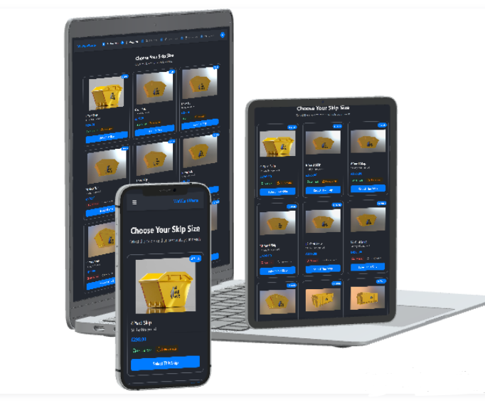

# ♻️ WeWantWaste – Skip Size Selector Redesign


A redesigned version of the **Choose your skip size** page for the WeWantWaste platform.  
Built with a focus on clean UI/UX, responsive design, and dynamic theme support (light/dark mode).  
Fully functional and ready for integration.

## 🚀 Live Demo

👉 [Click here to view the live demo](https://we-want-waste-nine.vercel.app/)

---

## 📸 Preview
<!-- preview gif -->
 

---

## ⚙️ Tech Stack

- **React 19** with **React DOM**
- **TypeScript** (strictly typed components)
- **Vite** for fast development and build
- **Tailwind CSS** for utility-first styling
- **React Router DOM v7** for routing
- **TanStack React Query v5** for data fetching and caching
- **Axios** for API communication
- **clsx** for conditional class handling
- **Lucide React** for clean, customizable SVG icons
- **React Spinners** for loading indicators
- **Custom Theme Context** (light/dark theme switcher)
- **Responsive Design** for all screen sizes
---

## ✨ Features

- ✅ Visual redesign of skip cards
- 🎨 Dynamic theming (light/dark mode)
- 📱 Fully responsive layout
- 🧠 Context API for global theme management
- 🧩 Component-based structure with clean separation of concerns

---

## 🌗 Theme Support

The app supports both **light** and **dark** modes.  
A `ThemeProvider` wraps the app and allows dynamic switching with a `useTheme()` hook, applying styles throughout via React and inline dynamic styling.

---

## 🔧 Installation & Running Locally

```bash
# Clone the project
git clone https://github.com/your-username/wewantwaste-skip-selector.git
cd wewantwaste-skip-selector

# Install dependencies
npm install

# Run the development server
npm run dev
```
